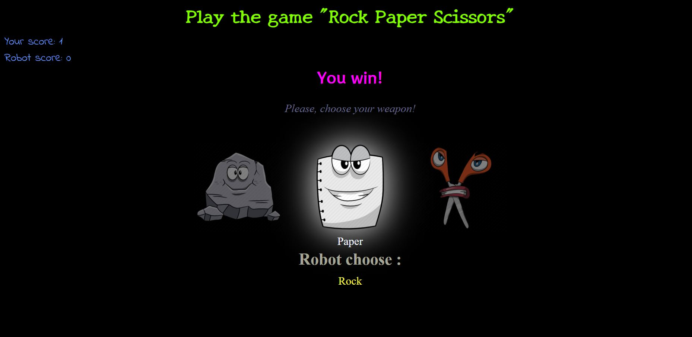

# PaperRockScissors

> Javascript-based game, played between you and the computer.
> It has only two possible outcomes: a draw, or a win for the one and a loss for the other.
> Have fun & good luck!



## Built With

- Major languages
- Frameworks
- Technologies used

## Getting Started

To get a local copy up and running follow these simple example steps.

## Live Demo

[Live Demo Link](https://polinastamenova.github.io/Game-rock-paper-scissors/)

## Instructions

To get a local copy up and running follow these simple example steps.

```
$ cd <folder>
```

```
$ git clone https://polinastamenova.github.io/Game-rock-paper-scissors/
```

### Install

- Set up liveserver as an extension in your VS Code.
- If you dont have the live server extension, or are using another software just view directly in your browser.

### Usage

- Right click and open the index.html in your browser to view.

## Authors

👤 **Polina Stamenova**

- GitHub: [@githubhandle](https://github.com/PolinaStamenova)
- LinkedIn: [LinkedIn](https://www.linkedin.com/in/polina-stamenova-a60766112/)

## 🤝 Contributing

Contributions, issues, and feature requests are welcome!

Feel free to check the [issues page](https://github.com/PolinaStamenova/Game-rock-paper-scissors/issues).

## Show your support

Give a ⭐️ if you like this project!

## Acknowledgments

- Hat tip to anyone whose code was used
- The Odin Project
- Inspiration
- etc
